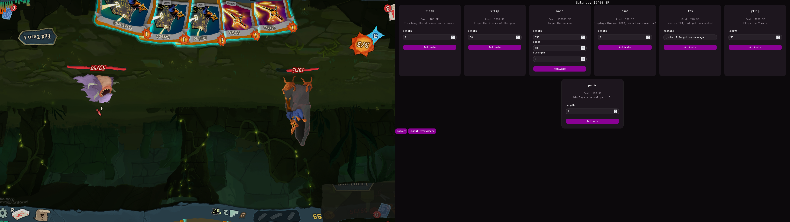

# OverlayBot

A Twitch-integrated overlay compositor for Linux.

## Technical Overview

- **Primary language:** LuaJIT
- **FFI:** Hand-made LuaJIT FFI definitions for 
    - X11 (including the XComposite and XFixes extensions)
    - libndi
    - libwebp
    - libpng
    - core OpenGL functions; OpenGL function loading via ffibuild's OpenGL bindings
- **Image loading:** Custom LuaJIT/FFI code interfacing directly with libwebp and libpng at the C API level
- **Process tracking:** bpftrace + ncat pipeline for live process tree construction and X11 focus correlation
- **Video pipeline:** NDI input from OBS, composited in real time via OpenGL
- **Platform:** Linux

## Window Targeting & Recompositing

The target window's output is redirected off-screen via XComposite, allowing OverlayBot to redraw its contents.
A small bpftrace script tracks fork, exec, and exit syscalls. ncat bridges the bpftrace output back to OverlayBot, 
which uses the information to construct a process tree and correlate the focused window against it, 
ensuring the captured window is always one that belongs to the target application.

## Features

- Screen flip (horizontal/vertical) triggered by points-gated channel commands
- Amazon Polly TTS channel command, points-gated
- Cheer and redeem-based points economy
- NDI broadcast ingestion and compositing

## Status

Personal project, active development. 
Some dependencies are not included in this repository. 
Not packaged for general use.

## Media

