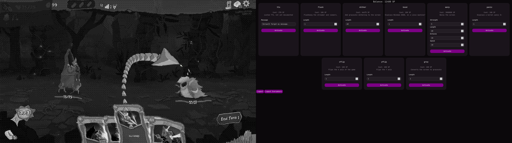
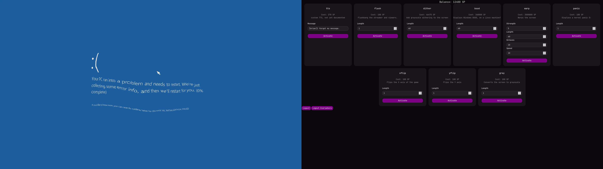

# OverlayBot

A Twitch-integrated overlay compositor for Linux.
Captures and redraws the focused window within the launched process tree, allowing viewers to apply various effects and images.

## Technical Overview

### Technology

- **Primary language:** LuaJIT
- **FFI:** Hand-made LuaJIT FFI definitions for 
    - X11 (including the XComposite and XFixes extensions)
    - libndi
    - libwebp
    - libpng
    - core OpenGL functions; OpenGL function loading via ffibuild's OpenGL bindings
- **Image loading:** Custom LuaJIT/FFI code interfacing directly with libwebp and libpng at the C API level
- **Process tracking:** bpftrace + ncat pipeline for live process tree construction and X11 focus correlation
- **Video pipeline:** NDI input from OBS + window capture from X11 +  composited in real time via OpenGL
- **IPC:** JSON over Websocket, JSON over TCP 
- **Platform:** Linux

### Window Targeting & Recompositing

The target window's output is redirected off-screen via XComposite, allowing OverlayBot to redraw its contents.
A small bpftrace script tracks fork, exec, and exit syscalls. ncat bridges the bpftrace output back to OverlayBot, 
which uses the information to construct a process tree and correlate the focused window against it, 
ensuring the captured window is always one that belongs to the target application.

### IPC

Connects to and interacts with a Node and TypeScript based server over a secure WebSocket.
- Serves introspection information about available redeems
- Allows remote triggering of redeems
- Provides balance information for viewer connections
Provides a local server speaking JSON, allowing the streamer to show and hide the overlay via external tools.

## Features

- Cheer and redeem-based points system
- Points gated redeems that apply effects and images to the captured window for viewer supplied amount of time
    - X/Y flip effect
    - bright flash
    - fake BSOD
    - fake kernel panic
    - screen warp with configurable perlin noise octave, movement speed, warp strength
    - dithering effect
    - grayscale effect
- Amazon Polly TTS redeem
- NDI broadcast ingestion and compositing

## Status

Personal project, active development. 
Some dependencies are not included in this repository. 
Not packaged for general use.

## Media

